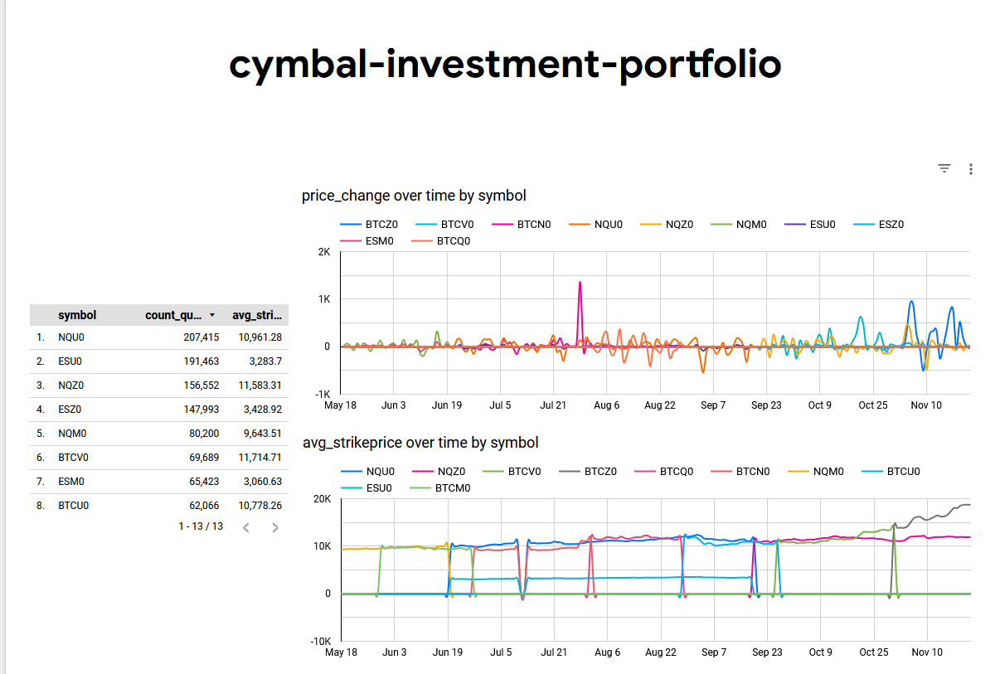

Overview

Cymbal Investment Portfolio is a data processing project that leverages PySpark, BigQuery, and Terraform for managing and analyzing investment data. The project processes trade data to compute aggregated statistics and track price changes over time.

Tech Stack

PySpark: Data transformation and processing

BigQuery: Data storage and querying

Terraform: Resource management and infrastructure provisioning

Workflow

1. Connect to bigquery for source data.
2. Transform data into below format

and make basic dashboard over it.
looker dashboard:-

🔥 Complete Apache Spark Learning Plan (with PySpark, Delta Lake & Databricks)
📘 Phase 1: Spark & PySpark Fundamentals (Week 1)

Goal: Understand Spark’s architecture and start writing PySpark code.
Topics:

    What is Spark? Why Spark over MapReduce?

    Spark Architecture: Driver, Executors, DAG

    PySpark setup (local/Colab/Databricks)

Hands-on:

    Install Spark locally or use Databricks Community Edition

    Run basic PySpark scripts (RDDs, simple transformations)

Resources:

    Spark: The Definitive Guide (Ch. 1–3)

    Databricks Free PySpark Crash Course

    YouTube: Spark Full Course – Simplilearn

📘 Phase 2: DataFrames, SQL & ETL (Week 2–3)

Goal: Master Spark DataFrames and SQL for data processing.
Topics:

    RDD vs DataFrame

    Reading/writing files (CSV, JSON, Parquet, AVRO)

    DataFrame operations: filter, select, join, groupBy

    Spark SQL & temp views

    UDFs in PySpark

Hands-on:

    Build a simple ETL pipeline with Parquet output

    Write SQL queries over structured data

Resources:

    Spark SQL Docs

    PySpark by Examples

    Databricks Quickstart Notebooks

📘 Phase 3: Delta Lake & Lakehouse Architecture (Week 4)

Goal: Learn Delta Lake for reliable, scalable pipelines.
Topics:

    What is Delta Lake and ACID in Spark

    Time travel, schema enforcement, change data capture

    Table versioning and upserts (MERGE INTO)

    Delta vs Parquet

Hands-on:

    Convert Parquet to Delta

    Time travel & schema evolution example

    Merge CDC data into Delta tables

Resources:

    Delta Lake Documentation

    Databricks Delta Lake YouTube Series

    Databricks Delta Quickstart

📘 Phase 4: Spark Structured Streaming (Week 5–6)

Goal: Build scalable streaming pipelines with PySpark.
Topics:

    Structured Streaming architecture

    Source types: Kafka, files, socket

    Triggers, watermarking, windowed aggregations

    Streaming joins

    Handling late data

Hands-on:

    Streaming file ingestion (CSV/JSON)

    Kafka source → Delta sink pipeline

    Use withWatermark, window, groupBy

Resources:

    Structured Streaming Docs

    YouTube: Spark Streaming by DataTalksClub

    Kafka + Spark + Delta Example

📘 Phase 5: Optimization & Tuning (Week 7)

Goal: Understand how to make Spark jobs efficient.
Topics:

    Spark UI, DAG visualization

    Partitioning, bucketing

    Shuffle, broadcast joins

    Caching and persistence

    Adaptive Query Execution (AQE)

Hands-on:

    Profile a job using Spark UI

    Compare performance: broadcast join vs shuffle join

Resources:

    Spark Tuning Docs

    Data Mechanics Blog: Spark Performance Best Practices

    YouTube: Spark Tuning by ItVersity

📘 Phase 6: Databricks & Cloud (Week 8)

Goal: Work with Spark in a cloud-native or enterprise setting.
Topics:

    Databricks notebooks, clusters, jobs

    MLflow integration

    DBFS, workspace management

    CI/CD for Spark (Databricks CLI, Jobs API)

Hands-on:

    Use Databricks for developing and scheduling jobs

    Build and deploy a pipeline with Delta + Streaming

    Use MLflow for model tracking (if interested in ML)

Resources:

    Databricks Developer Resources

    Databricks Academy Free Courses

    Databricks CLI Docs

Final Capstone Project (Optional but Recommended)

Goal: Combine everything into a real-world scenario.

Example Project:

    Source: Kafka (or simulated JSON files)

    Transformation: PySpark ETL (cleansing, enrichment)

    Storage: Delta Lake tables with schema evolution

    Output: SQL queries + BI dashboard (Databricks SQL or Power BI)